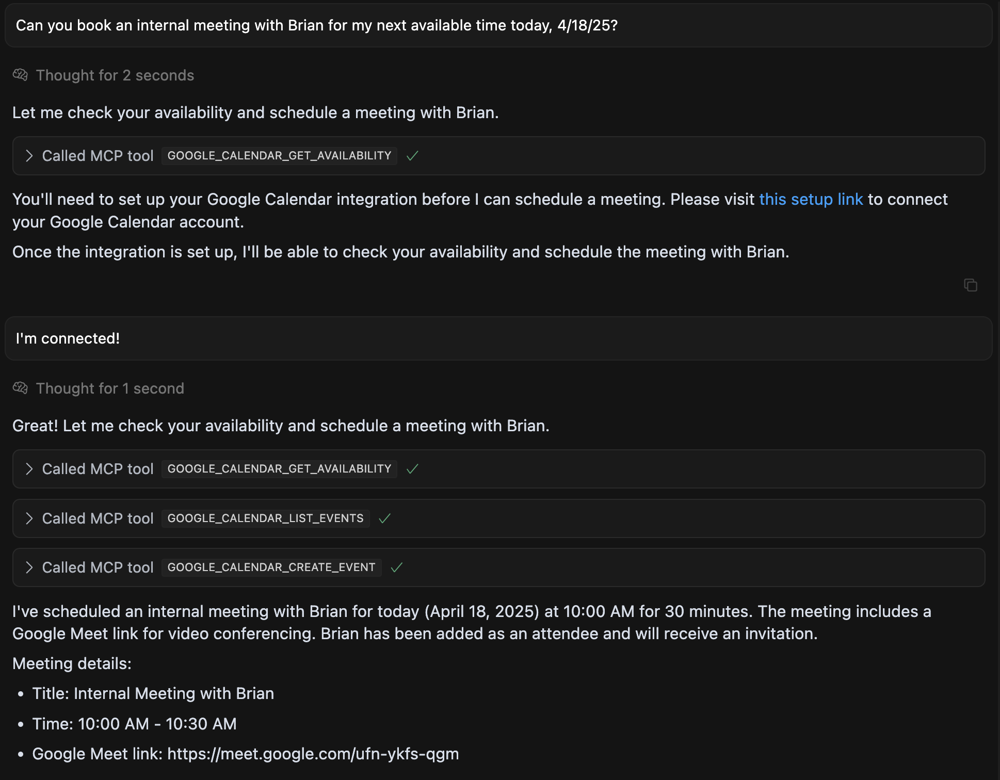

<p align="center">
  <a href="https://www.useparagon.com/" target="blank"></a>
</p>

<p align="center">
  <b>
    The embedded integration platform for developers.
  </b>
</p>

---

# Paragon MCP Server

A server implementation for Model Context Protocol (MCP) that integrates with [ActionKit](https://useparagon.com/actionkit), an API by Paragon that provides access to prebuilt actions for 130+ integrations to your users' SaaS applications.

## Features

| Example Chat | Setup Link |
|:-------------:|:----------:|
|  |  |

- Add user-facing integrations from your Paragon account as available capabilities to your agent, for example:
  - **Google Calendar**: Create or update events and get calendar availability on your user's behalf.
  - **Salesforce**: Query and manage records from your user's CRM.
  - **Slack**: Send notifications to your user's Slack workspace.
- Automatically prompt users to authorize integrations with the [Connect Portal](https://docs.useparagon.com/getting-started/displaying-the-connect-portal), a prebuilt component for secure OAuth 2.0 and API Key intake flows.
- Optionally: add [Custom Actions](#adding-custom-actions-with-openapi) or [direct API access](#using-experimental-proxy-api-tool) as available tools in the MCP.


## Prerequisites

To start using the Paragon MCP Server, you will need to [sign up and register for a Paragon account](https://dashboard.useparagon.com/signup).

- Node.js @ 22.14.0
- npm package manager

## Installation

1. Clone the repository
2. Install dependencies:

```bash
npm install
```

### Environment Variables

Create a `.env` file in the root directory by running:
```
cp .env.example .env
```

Set up the environment variables as described below:

- **Required:**
  - `PROJECT_ID`: Your Paragon project ID)
  - `SIGNING_KEY`: Your JWT signing key (requiredif SIGNING_KEY_PATH is not set)
  - `SIGNING_KEY_PATH`: Path to your JWT signing key file (required if SIGNING_KEY is not set)
- Optional:
  - `LIMIT_TO_INTEGRATIONS`: Comma-separated list of integration names to limit the types of available tools.
  - `LIMIT_TO_TOOLS`: Comma-separated list of tool names to additionaly limit available tools if needed.
  - `PORT`: Server port (default: 3001)
  - `MCP_SERVER_URL`: The URL of your hosted MCP Server. This will be used to generate Setup Links when your users are prompted to install integrations. (default: `http://localhost:3001`)
  - `CONNECT_SDK_CDN_URL`: Paragon Connect SDK CDN URL (default: https://cdn.useparagon.com/latest/sdk/index.js)
  - `ACTIONKIT_BASE_URL`: Paragon ActionKit base URL (default: https://actionkit.useparagon.com)
  - `ZEUS_BASE_URL`: Paragon API base URL (default: https://zeus.useparagon.com)
  - `PROXY_BASE_URL`: Paragon Proxy API base URL (default: https://proxy.useparagon.com)
  - `NODE_ENV`: Node environment (default: `development`)
    <sub>**Note**: When `NODE_ENV` is set to `development`, the `/sse` parameter accepts any user ID in the `?user=` query parameter to automatically authorize as a specific user while testing locally.</sub>

### Running the Server

Start the server using:

```bash
npm run start
```

The server will start on `http://localhost:3001` by default.

## Cloudflare Containers (Dockerfile) Deployment

This repo is configured to deploy via Cloudflare Containers using the root `Dockerfile` and a small Worker shim in `worker/`.

- Local dev
  - Start the app locally (Docker or Node):
    - Docker: `docker compose up --build` (exposes `http://localhost:3001`)
    - Node: `npm run start` (ensure `.env` variables are set)
  - Copy `.dev.vars.example` to `.dev.vars` and adjust if needed
  - Run: `npx wrangler dev` and open the printed URL (default 8787)

- Deploy (after filling Cloudflare creds)
  - Fill `account_id` in `wrangler.toml`
  - Auth: `npx wrangler login`
  - Deploy: `npx wrangler deploy`

Notes:
- The Worker uses `@cloudflare/containers` to route to your Dockerfile-backed container in production.
- In `wrangler dev`, the Worker proxies to `LOCAL_UPSTREAM` (defaults to `http://127.0.0.1:3001`).
- Set secrets with `npx wrangler secret put NAME`.

## Client Configuration

> **Note:** Cursor's MCP implementation is a very new protocol and is still in active development. You might encounter unexpected issues. When making changes to the MCP server URL, a full client restart is recommended. For more information about current limitations, see the [Cursor MCP documentation](https://docs.cursor.com/context/model-context-protocol#limitations).

### Cursor

To use this MCP server with Cursor, add the following to your Cursor configuration file at `~/.cursor/mcp.json`:

```json
{
  "mcpServers": {
    "mcp-actionkit-dev": {
      "url": "http://localhost:3001/sse?user=[user-id]"
    }
  }
}
```

Replace:

- `http://localhost:3001` with your server's domain
- `user-id` with the ID for the Connected User to use with ActionKit (this parameter only available in development mode)

### Claude

To use this MCP server with Claude, add the following to your Claude configuration file at `~/Library/Application Support/Claude/claude_desktop_config.json`:

```json
{
  "mcpServers": {
    "actionkit": {
      "command": "npx",
      "args": ["mcp-remote", "http://localhost:3001/sse?user=[user-id]"]
    }
  }
}
```

Replace:

- `http://localhost:3001` with your server's domain
- `user-id` with the ID for the Connected User to use with ActionKit (this parameter only available in development mode)

## Deploying the MCP Server
The Paragon MCP server can be completely **self-hosted**. Deploy the MCP Server via Docker in any 
cloud hosting platform of your choice.

For testing, you can one-click deploy the server through Heroku.

[](https://www.heroku.com/deploy?template=https://github.com/useparagon/paragon-mcp)

## API Endpoints

- `GET /sse`: Establishes SSE connection for MCP communication
- `POST /messages`: Handles MCP message processing
- `GET /setup`: Handles integration setup flow

### Authorization

The `GET /sse` endpoint (base URL for the MCP using the SSE transport) accepts an `Authorization` header with a Paragon User Token as the Bearer token.

The Paragon User Token is an RS256-encoded JWT that is verified using the public key stored by Paragon. Your MCP client (e.g. your application server or the service running your AI agent) will sign the User Token using the matching private key generated in the Paragon dashboard, which only your server has access to.

This allows the MCP to validate the authenticity of the requesting user using the JWT signature and public key. Once authenticated, the MCP will associate the user ID encoded in the JWT with the active MCP session.

## Adding Custom Actions with OpenAPI

To add your own Custom Action definitions:

1. Set `ENABLE_CUSTOM_OPENAPI_ACTIONS=true` in your environment (e.g. .env file).
2. Create an `openapi/` subfolder at the root of the repository.
3. Add OpenAPI specs in YAML or JSON format, using the integration name as the file name.
    - For example, if you are adding Custom Actions for Google Calendar, the OpenAPI specs should be located at: `openapi/googleCalendar.json`.
    - If you are adding Actions for a Custom Integration, use the SDK name of the integration, with the `custom.` prefix: `openapi/custom.spotify.json`.

The MCP will automatically match OpenAPI files with Active integrations in your Paragon project to augment the list of available tools returned by the MCP.

## Using experimental Proxy API tool

> [!WARNING]
> Enabling this tool allows your agent to write its own API requests with the account you connect. Always review the request before allowing the agent to use this tool to safeguard against unexpected changes.

To allow the agent to write its own requests to the integration API, set `ENABLE_PROXY_API_TOOL=true` in your environment.

## License

This project is open source and available under the [MIT License](https://opensource.org/license/mit).
